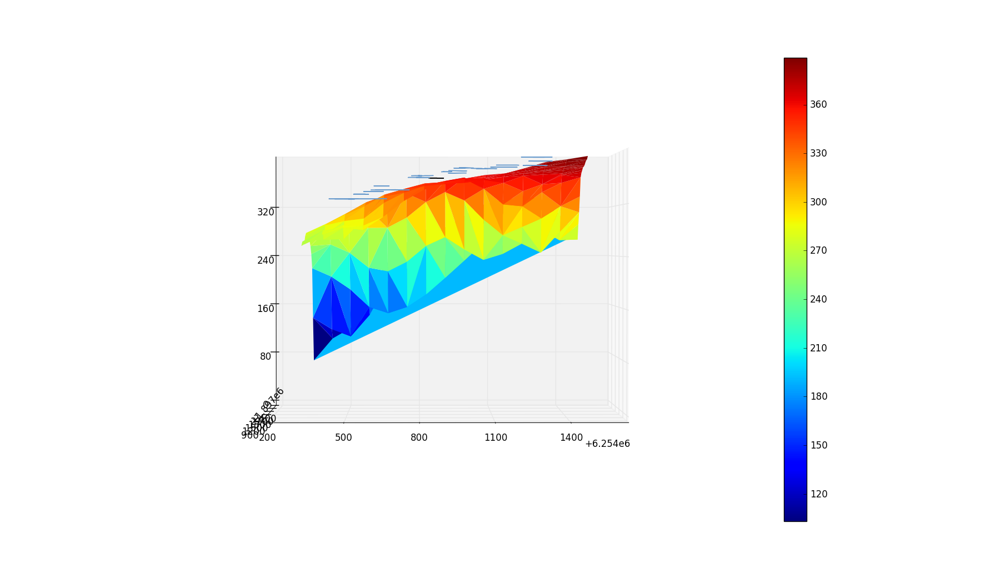
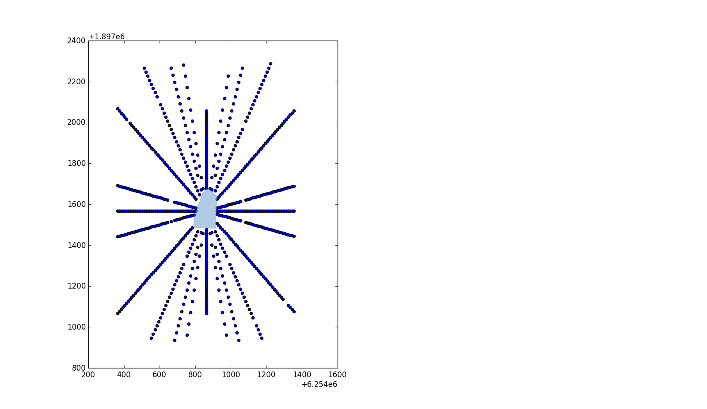

# Corelogic Grand Challenge

## The problem
The Corlelogic Grand Challenge was a competition to solve a problem for [Corelogic](https://en.wikipedia.org/wiki/CoreLogic) - an Irvine based Data Analytics and Warehousing company, providing financial, property and consumer information, analytics and business intelligence.

The problem was as follows:
> Given a specific house, how can you calculate the view obstruction for the property in all directions?

* They also provided a dataset of ~65000 houses to analyze.
* Disclaimer: We had a month to complete this challenge. During this month I was also taking a class in machine learning. As a result time wasn't really on my side and the code quality isn't stellar. When I get a chance i'll go through and refactor, comment, and clean up my codebase.

### The Given Data

[Corelogic's data](images/corelogicDataExample.csv) included columns such as:

* Formatted APN (property ID)
* Lat/Long
* Address
* Square footage

Corelogic's data did not include all surrounding homes for every property. Obviously the houses on the border of this giant list of homes don't have data on all their surrounding houses.

So it was incomplete, and I went searching for more data.

## The solution
My goal was to output a single number that would rate the view obstruction as accurately as possible. Other solutions to the challenge included GUIs and webapps, but my philosophy was, "this is a data science challenge, let's just analyze the data as accurately as possible."
### The Found Data

I used four distinct sources to solve this problem...

#### *1. Google Elevation API*

The Google Elevation API takes in a lat long and returns an elevation. This means that we can easily map all the surrounding elevations with a grid of points. This also means lots of API calls, and the limit for a free subscription is 2500/day - meaning I can only do a few rows at a time.

So we take a lat long, and create a bounding box.
```python    
getElevationGoogleBox(latitude + 0.002, longitude + 0.002, latitude - 0.002, longitude - 0.002, 15, 15)
```
As you can see our bounding box is 0.004&deg; (latitude) by 0.004&deg; (longitude). We also passed in "15,15" which are our column and row count.
```python   
def getElevationGoogleBox(lat1, long1, lat2, long2, rows, cols):
    incrementX = abs((lat1-lat2)/cols)
    incrementY = abs((long1-long2)/rows)

    x = lat1
    y = long1

    points = []

    for i in range(rows):
        for j in range(cols):
            points.append((x, y, getElevationGoogle(x, y)))
            y = y - incrementY

        x = x - incrementX
        y = long1

    return points
```
Which gives us a nice grid of ColxRow points.

Which we can then map, using [matplotlib](http://matplotlib.org), as a 3D surface.


You can see the X and Y axes aren't in Lat/Long. This is because for this project it was easiest to convert everything to [stateplane](https://en.wikipedia.org/wiki/State_Plane_Coordinate_System). You can read more in the link provided, but basically it's a 2D coordinate system that divides states into zones where every zone has an origin. The coordinates are in feet and are all positive relative to the chosen origin for that zone. The zone we are in for La Jolla is [California Stateplane Zone 6](http://spatialreference.org/ref/epsg/2227/). I used [pyproj.Proj](https://jswhit.github.io/pyproj/pyproj.Proj-class.html) to convert the coordinates.

#### *2. Google Static Maps API*
The google static maps API takes in a lat/long, zoom, image format/type, and many other parameters to spit out a basic satellite image. Luckily we only call this API once per property.

The sleight of hand trick here is styling the image. You can grab an roadmap-type image that strips away the satellite image and leaves the roads, lots, and houses for you (like you would see on a paper map), and then process it using an image segmentation library. The styling is built into the google static maps API.

For image segmentation I used [scikit-image](http://scikit-image.org). After cropping the google watermark, converting the image to gray scale, and separating sections of the image based on their grayscale, we get this:


Then, using [find_contours](http://scikit-image.org/docs/dev/api/skimage.measure.html?highlight=find_contours#skimage.measure.find_contours) we can get the outlines of all these shapes in terms of pixel coordinates. We ignore the shapes that are cut off by the edge of the image:
```python    
contoursBuildings = find_contours(binary_imageBuildings, 0.1)
surroundingPolygons = []

for n, contour in enumerate(contoursBuildings):
        coords = approximate_polygon(contour, tolerance=3.5)
        if len(coords) >= 4:
            # to make sure we don't get house polygons that are cut off
            if not any(0.0 in subl for subl in coords):
                if not any(639.0 in subl for subl in coords):
                    yValues = []
                    for i in coords:
                        yValues.append(i[0])
                    #because we cropped the image, 640-22 = 618
                    if 617.0 not in yValues:
                        surroundingPolygons.append(coords)
```
And we get:

We can play with the tolerance value to accomodate for weird shapes.

So now that we have the outlines of all the surrounding houses in pixel coordinates, we can do the same for the lots:


To convert out outlines from pixel coordinates to lat/long (and then subsequently to stateplane) we use [Mercator Projection](https://en.wikipedia.org/wiki/Mercator_projection#Derivation_of_the_Mercator_projection). I won't get into that now but it's basically a way to wrap a cylinder around our spherical earth, and then unwrap that cylinder into a 2D map. On a large scale it distorts the sizes of land masses, but for our purposes it shouldn't be a problem.

To interpret all these polygons I used [shapely](http://toblerity.org/shapely/). We can map the houses and their lots in stateplane coordinates:

The red polygon is red because that's an indication that it's not valid - i.e. it's got some weird hole or corner that screws it up. Still workable though.

#### *3. Zillow API*
The [Zillow API](http://www.zillow.com/howto/api/APIOverview.htm) takes in an address and gives back a bunch of information about the property. This helped me supplement the data given to us by Corelogic because I can learn about the existing and missing houses' information. I used the python Zillow API wrapper [pyzillow](https://pypi.python.org/pypi/pyzillow/0.5.5) to grab the data.

The Zillow API gives us columns like:
* zillow_id
* home_type
* latitude
* latitude
* tax_value
* property_size
* home_size
* bathrooms
* bedrooms
* num_floors (only known through user input so it's very rare and unreliable)

The Zillow data for a property isn't always available. The number of floors specifically isn't ubiquitous enough to use for every surrounding property. The **problem** is we need the number of floors to be able to map all our house polygons on the elevation surface at their respective heights. A neighboring house to our chosen property would obstruct the view a whole lot more of it was 2 floors as opposed to 1.

#### *4. SanGIS*
The [SanGIS](http://www.sangis.org) data was a godsend. There were an overwhelming amount of missing values in the corelogic data (surrounding houses as well as existing features) even when supplemented by the Zillow API. Luckily, the San Diego government provides free datasets on all the properties in San Diego County. This comes in the form of a 4GB [shapefile](https://en.wikipedia.org/wiki/Shapefile). The shapefile is basically a way to store geographic/geometric vector information and assign a data table to the shapes.

The data included information for almost every property we needed. 4GB is way to big to load into RAM when we run our code in Spyder, so I had to import it into a local [PostgreSQL](https://www.postgresql.org) database (which  included the extension [PostGIS](http://www.postgis.net) that allows us to store geographic objects and run SQL queries on them). The SanGIS data, for each property, included columns like:

* APN
* Address
* Square footage
* Tax value
* Land value
* Bed/bath
* GEOM - the geometric shape of the parcel in stateplane coordinates

If we want to find the data on each house/lot that we grabbed from the google maps image we need to be able to compare the image polygons to our SanGIS polygons. We can already easily grab the centroids for our house polygons in stateplane from the maps image using the shapely [centroid](http://toblerity.org/shapely/manual.html#object.centroid) function. However to run a SQL query on our SanGIS geometry data we need to have a column to query! We can't query the geom column because we would need to programmatically grab the centroid from each shape. Instead, we can create 2 columns for the X and Y values of each property's centroid.
```python
def getCentroids():
    engine = create_engine('postgresql://@localhost:5432/parcels')
    sql3 = """ALTER TABLE parcelterminal ADD x_coord GEOMETRY;"""
    sql4 = """ALTER TABLE parcelterminal ADD y_coord GEOMETRY;"""
    engine.connect().execute(sql3)
    engine.connect().execute(sql4)

    for i in range(1, 1061753):
        sql = 'SELECT *, ST_AsText("geom") FROM public.parcelterminal WHERE "id" = {};'.format(i)
        data = pd.read_sql(sql, engine)
        shape = wkt.loads(data['st_astext'].iloc[0])
        centroid = shape.centroid.wkt
        sql1 = """
        UPDATE public.parcelterminal
        SET x_coord = ST_GeometryFromText('{}', 2230)
        WHERE id = {};
        """.format(centroid.x, i)
        engine.connect().execute(sql1)
        sql2 = """
        UPDATE public.parcelterminal
        SET y_coord = ST_GeometryFromText('{}', 2230)
        WHERE id = {};
        """.format(centroid.y, i)
        engine.connect().execute(sql2)
```

Now we can find the data for every polygon we grabbed off google maps! Very useful. But for the sake of speed we'll grab the nearest properties in the table compared to our chosen house.

```python
    sql = 'SELECT * FROM public.parcelterminal WHERE "apn" = \'{}\';'.format(APN.replace("-", ""))
    parcel = pd.read_sql(sql, engine)

    x = parcel['x_coord'].iloc[0]
    y = parcel['y_coord'].iloc[0]
    x_bounds = (x + 450, x - 450)
    y_bounds = (y + 450, y - 450)

    sql = 'SELECT *, ST_AsText("geom") FROM public.parcelterminal WHERE "x_coord" < {} AND "x_coord" > {} AND "y_coord" < {} AND "y_coord" > {};'.format(x_bounds[0], x_bounds[1], y_bounds[0], y_bounds[1])  
    surroundingParcels = pd.read_sql(sql, engine)
```

Now we can compare that table to our table of polygons from the maps image. For a visual aide see the [polygon data table](images/nearestPolygonsData.csv) versus the [properties data table](images/nearestParcelsData.csv).

This is all necessary because now, we can derive the floor number!

### The Analysis
We've gathered our data from our sources and organized it into a nice [pandas](http://pandas.pydata.org) dataframe - surroundingProperties let's say - that includes the surrounding houses and their shapes as well as the property information. This can be done for any row in the data, returning the dataframe of the surrounding houses.

#### *Floor Derivation*
When trying to derive the number of floors each surrounding house has, we focus on 5 factors:
* Observed square feet - calculating the area of the polygon that we grabbed from the google maps image
* Expected square feet - the square feet in the property information
* Land value
* Tax assessed value - value of home including land value
* Bedrooms/bathrooms

Clearly if our expected square feet, which includes every room for both floors (if it's a 2 story home) is much larger than our observed square feet (taken from just the geographic imprint), the house has 2 floors.

So we calculate some ratios, and end up with a tuple of 3 items for each property:
* Square feet ratio - Expected sqft/Observed sqft
* Value ratio - (Tax assessed val - land val)/Observed sqft
* Bed/bath - # of bedrooms + # of bathrooms

So we take these three values and estimate the floor number for each home in our surroundingProperties dataframe.

#### *3D Mapping*

Finally, after assembling our data on elevation and surroundingProperties, we can visualize all our hard work in a pretty little 3D plot. All the shapes are accurate to the those houses layouts, and the height of the polygon is roughly at the height of each roof. If it's a 1 story home we put it 15 ft above it's elevation, if it's a 2 story home we put it 23 ft above it's elevation.

We find the elevation for each property by looking at its centroid and finding the nearest elevation point.





#### *Lines of Sight*
Lastly, to actual get the calculation of view obstruction, we use a pretty intuitive technique. At 5 feet above the property elevation (approximately eye level) we shoot out lines of sight in all directions.

These lines of sight consist of points every 10 feet or so, and at each point at it's respective elevation we calculate the LOS delta. The LOS delta is simple the difference between that point's elevation, and the elevation of the object directly above or below it. The object can either be a triangular elevation plane or the roof of a house.

So our algorithm looks pretty simple for roofs. We can interpret the point's position just in terms of X and Y (still in stateplane) and then cycle through the house polygons and see if the point is inside.

Elevation is a bit more tricky. For every point there are a total of 3 points nearby, creating a triangle. Using some math we calculate the distance from the point to the plane that is created by the 3 points in 3 dimensions.

After our calculations we end up with a line of sight with deltas like this:


#### *Calculation*
The final calculation we need to do is just derive our view obstruction from the lines of sight. This can be done many ways. For the moment I have chosen the simplest path.

To add up all the deltas we take into account their distance from the property. The farther they are the less they are worth, since objects closer to you take up more of your FOV. Using these weights we add up all the lines of sight and their deltas. Then we average it and voila, view obstruction calculation!

### Going Forward
While I am confident my solution is quite comprehensive, there are still many things I can do to improve it:
* Perfect my floor derivation algorithm, even though i'm sure Corelogic has that information in house
* Consider view quality, i.e. if it was of the ocean or a monument. The ocean one is easy since the ocean's elevation is 0.
* Improve my analysis of the lines of sight deltas - really do the math involved with it

Thanks for reading!
