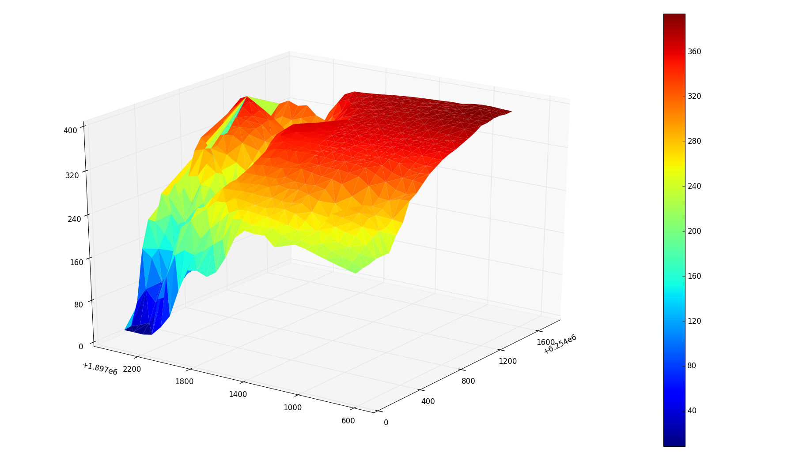

# Corelogic Grand Challenge

## The problem
The Corlelogic Grand Challenge was a competition to solve a problem for [Corelogic](https://en.wikipedia.org/wiki/CoreLogic) - an Irvine based Data Analytics and Warehousing company, providing financial, property and consumer information, analytics and business intelligence.

The problem was as follows:
> Given a specific house, how can you calculate the view obstruction for the property in all directions?

*They also provided a dataset of ~65000 houses to analyze.

### The Given Data

Corelogic's data included columns such as:

* Formatted APN (property ID)
* Lat/Long
* Address
* Square footage

Corelogic's data did not include all surrounding homes for every property. Obviously the houses on the border of this giant list of homes don't have data on all surrounding houses.

So it was incomplete, and I went searching for more data.

## The solution
My goal was to output a single number that would rate the view obstruction as accurately as possible. Other solutions to the challenge included GUIs and webapps, but my philosophy was, "this is a data science challenge, let's just analyze the data as accurately as possible."
### The Found Data

I used four distinct sources to solve this problem...

#### *1. Google Elevation API*

The Google Elevation API takes in a lat long and returns an elevation. This means that we can easily map all the surrounding elevations with a grid of points. This also means lots of API calls, and the limit for a free subscription is 2500/day - meaning I can only do a few rows at a time.

So we take a lat long, and create a bounding box.
```python    
getElevationGoogleBox(latitude + 0.002, longitude + 0.002, latitude - 0.002, longitude - 0.002, 15, 15)
```
As you can see our bounding box is 0.004&deg; (latitude) by 0.004&deg; (longitude). We also passed in "15,15" which are our column and row count.
```python   
def getElevationGoogleBox(lat1, long1, lat2, long2, rows, cols):
    incrementX = abs((lat1-lat2)/cols)
    incrementY = abs((long1-long2)/rows)

    x = lat1
    y = long1

    points = []

    for i in range(rows):
        for j in range(cols):
            points.append((x, y, getElevationGoogle(x, y)))
            y = y - incrementY

        x = x - incrementX
        y = long1

    return points
```
Which gives us a nice grid of ColxRow points.

Which we can then map, using [matplotlib](http://matplotlib.org), as a 3D surface.


You can see the X and Y axes aren't in Lat/Long. This is because for this project it was easiest to convert everything to [stateplane](https://en.wikipedia.org/wiki/State_Plane_Coordinate_System). You can read more in the link provided, but basically it's a 2D coordinate system that divides states into zones where every zone has an origin. The coordinates are in feet and are all positive relative to the chosen origin for that zone. The zone we are in for La Jolla is [California Stateplane Zone 6](http://spatialreference.org/ref/epsg/2227/). I used [pyproj.Proj](https://jswhit.github.io/pyproj/pyproj.Proj-class.html) to convert the coordinates.

#### *2. Google Static Maps API*
The google static maps API takes in a lat/long, zoom, image format/type, and many other parameters to spit out a basic satellite image. Luckily we only call this API once per property.

The sleight of hand trick here is styling the image. You can grab an roadmap-type image that outlines the roads, lots, and houses for you, and then process it using an image segmentation library. The styling is built into the google static maps API.

For image segmentation I used [scikit-image](http://scikit-image.org). After cropping the google watermark, converting the image to gray scale, and separating sections of the image based on their grayscale, we get this:


Then, using [find_contours](http://scikit-image.org/docs/dev/api/skimage.measure.html?highlight=find_contours#skimage.measure.find_contours) we can get the outlines of all these shapes in terms of pixel coordinates. We ignore the shapes that are cut off by the edge of the image:
```python    
contoursBuildings = find_contours(binary_imageBuildings, 0.1)
surroundingPolygons = []

for n, contour in enumerate(contoursBuildings):
        coords = approximate_polygon(contour, tolerance=3.5)
        if len(coords) >= 4:
            # to make sure we don't get house polygons that are cut off
            if not any(0.0 in subl for subl in coords):
                if not any(639.0 in subl for subl in coords):
                    yValues = []
                    for i in coords:
                        yValues.append(i[0])
                    #because we cropped the image, 640-22 = 618
                    if 617.0 not in yValues:
                        surroundingPolygons.append(coords)
```
And we get:

We can play with the tolerance value to accomodate for weird shapes.

So now that we have the outlines of all the surrounding houses in pixel coordinates, we can do the same for the lots:


To convert out outlines from pixel coordinates to lat/long (and then subsequently to stateplane) we use [Mercator Projection](https://en.wikipedia.org/wiki/Mercator_projection#Derivation_of_the_Mercator_projection). I won't get into that now but it's basically a way to wrap a cylinder around our spherical earth, and then unwrap that cylinder into a 2D map. On a large scale it distorts the sizes of land masses, but for our purposes it shouldn't be a problem. We can map the houses and their lots in stateplane coordinates:

The red polygon is just red because that's an indication that it's not valid - ie it's got some weird hole or corner that screws it up. Still workable though.

#### *3. Zillow API*
The [Zillow API](http://www.zillow.com/howto/api/APIOverview.htm) takes in an address and gives back a bunch of information about the property. This helped me supplement the data given to us by Corelogic because I can learn about the existing and missing houses' information. I used the python Zillow API wrapper [pyzillow](https://pypi.python.org/pypi/pyzillow/0.5.5) to grab the data.

The Zillow API gives us columns like:
* zillow_id
* home_type
* latitude
* latitude
* tax_value
* property_size
* home_size
* bathrooms
* bedrooms
* num_floors (only known through user input so it's very rare and unreliable)

The Zillow data for a property isn't always available. The number of floors specifically isn't ubiquitous enough to use for every surrounding property. The **problem** is we need the number of floors to be able to map all our house polygons on the elevation surface at their respective heights. A neighboring house to our chosen property would obstruct the view a whole lot more of it was 2 floors as opposed to 1.

#### *4. SanGIS*
The [SanGIS](http://www.sangis.org) data was a godsend. There were an overwhelming amount of missing values in the corelogic data (surrounding houses as well as existing features) even when supplemented by the Zillow API. Luckily, the San Diego government provides free datasets on all the properties in San Diego County. This comes in the form of a 4GB [shapefile](https://en.wikipedia.org/wiki/Shapefile). The shapefile is basically a way to store geographic/geometric vector information and assign a data table to the shapes.

The data included information for almost every property we needed. 4GB is way to big to load into RAM when we run our code in Spyder, so I had to import it into a local [PostgreSQL](https://www.postgresql.org) database (which  included the extension [PostGIS](http://www.postgis.net) that allows us to store geographic objects and run SQL queries on them).
